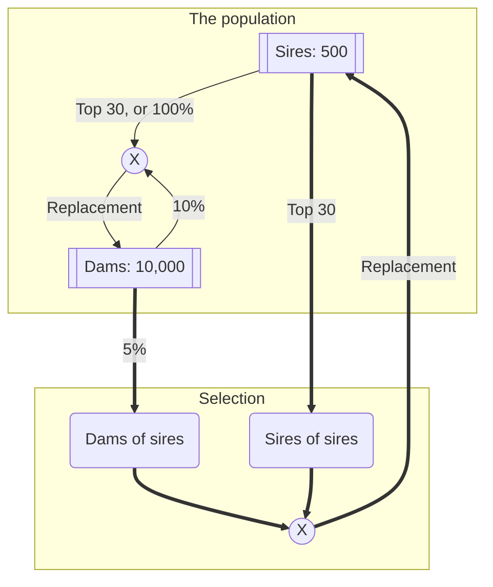
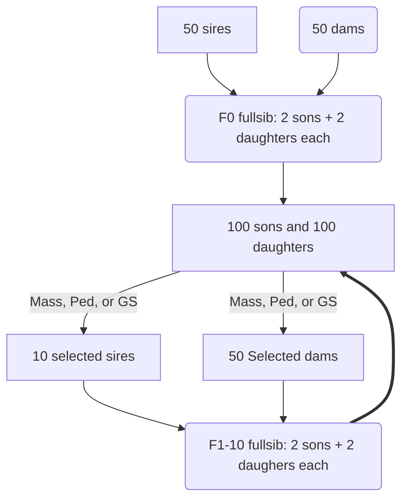

# Repeat Quinton et al., 1992, with genomic selection

<!-- `echo Repeat Quinton et al., 1991, with genomic selection | md5sum` => effb94... -->

## Summary

BLUP is better in short term selection.
But for long term selection, phenotypic selection is better.
Also, more genes are lost (for GS, quinton didn't simulate genotypes) 
and inbreeding increases faster with BLUP.
Genomic selection (GS) has similar problems, at least in theory.

This simulation is to repeat Quinton et al., 1991.
I also add genomic selection here.

## Simulation details

500 sires and 500 dams are simulated with `MaCS`. `SLiM` can be used later.
They are randomly mated to have 21 sibs in each family to
produce 10,500 offspring.
500 of them are nucleus with half male and female calves.
Sires for the next generation are selected from nucleus.
Dams for the next generation are selected from all the offspring.

Selections are done with phenotypic values and EBV from BLUP and GS.
Inbreeding, $\Delta G$, gene loss are recorded.

### A cattle selection scheme

A similar selection scheme is simulated for pigs.

## Progress

1. A starter population for selection
   1. [x] Formats of genotype and linkage map files
      - Genotypes
        - a 24-byte header
        - genotype matrix
      - Linkage map
        - A DataFrame
          - Chromosome number
          - BP position
          - Allele frequency
        - Serialized with `Serialization`
      - Tree storage is currently quite beyond my capacity
        - The storage
        - SNP coding
   2. [x] Simulate a base population with `MaCS`.
      - Can link to `SLiM` later.
      - 2000 haplotypes.
      - chromosome lengths are from NCBI
      - ~19M SNP
      - Genotype and linkage map files
   3. [x] Sample 50k SNPs, and 1000 pairs of haplotypes from the base population.
      - sample 10k QTL, then
      - sample 50k SNPs from the 19M total SNPs
   4. [x] Mate 500 sires and 500 dams to produce 10,500 offspring, totally random not full sib of 21.
      - expand to 10,500 offspring
      - 500 $\to$ 50 sires.
        - no selection on cows.
        - or using best cows to produce 500 sires.
        - always 10k cows
          - only cows have records
        - number of bulls to be selected as a parameter
          - e.g., 1000 $\to$ 50 bulls
      - Unique coding of the SNP alleles using `UInt16`.
      - odd for SNP allele 1, even for 0.
      - Can code at least $2^{14} = 16,384$ ID, or 32,768 haplotypes.
2. Selection simulation
   1. [x] Selection with genomic selection, SNP-BLUP
      - for 10 generations.
      - add mutations? 50-60 per ID per generation.
      - a QTL can be a mutation on the 5k genes.
      - may have 10k genes.
   2. [x] Selection with BLUP
   3. [x] Selection with phenotypic values
   4. [x] repeat quinton's scheme as a starter
   5. [x] early progress on Friday.

## ToDo

1. [ ] Calculate LD to verify the sampling.
2. [ ] Make the `mate` function work.
3. [ ] Rich `test` sets for critical functions.
4. [ ] several slides for report with simple results

## Focus

The algorithm
$$\left\{\begin{array}{c} n = 30\\ f = 5\%\end{array}\right.$$

- [x] MaCS $\to$ Founder, or 2000 haplotypes
- [ ] The $F_0$ generation
  - [x] Sample haplopypes from the founder $\to$ 1000 pairs, for 500♂ and 500♀
  - [x] Sample 50k SNPs and 10k QTL from the 19M total SNPs
  - [x] Random (totally) mate 500♂ and 500♀ to produce 10,500 offspring
    - where, 500 are ♂, 10,000 are ♀
    - [x] decide the parents
    - [x] mate founders and produce $F_0$
- [ ] Selection methods
  - [x] *Phenotypic selection*
  - [x] PBLUP
  - [x] Genomic selection
- [x] Selection strategy
  - [x] Sample QTL and SNP separately from 19M founder SNP
  - [x] Select $n$ ♂ from 500 ♂
  - [x] Select $f$ ♀ from 10,000 ♀ as the mother of sires of the next generation

!!! note
    The simulation is still in debugging stage.
    No result yet.

## Simulation scheme from Quinton et al., 1992

- 50 sires and 50 dams
- 2 males and 2 females per family
- $h^2 = 0.05, 0.1, 0.25, 0.5$, I use 0.25 here.
- 10 generations
- Select 1, 2:2:40 sires out of 100 sons, I use only 10 here
- Select 50 out of 100 daughters

### Added scenarios GS

- 50k SNPs, 10k QTL
- Alternative $\sigma_a^2 = 1$, $\sigma_e^2 = 3$, $\Rightarrow h^2 = 0.25$.
  - Instead of $\sigma_p^2=1$
- Full pedigree and genotypes from generation -1 to 10
- Using IBD for inbreeding calculation
- Alternative: random mating $F_{-1}$ to produce 200 $F_0$

### Action points
- Scenarios
  - [x] more generations, 20.
  - [x] twice sires, 20
  - [ ] run a scheme with sire phenotypes, only to compare gs and ped.
- Report
  - [ ] positive qtl lost
    - [ ] my: potents, e.g., sum of the positive QTL
    - [ ] using proportions lost
  - [ ] plot $\Delta G$ against inbreeding
  - [ ] add x, y labels to the plots

*multiple factor incidence matrix function not right*